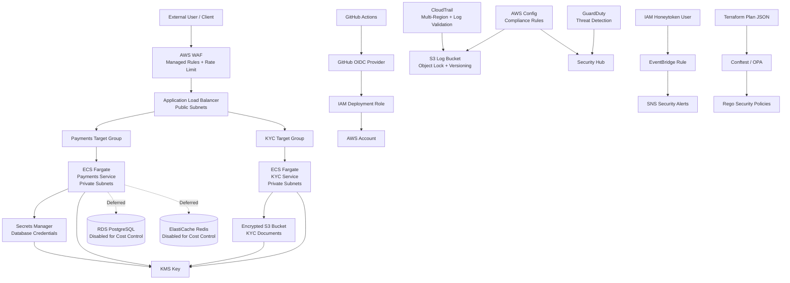

# SentinelPay Technologies — Week 2 Review

## 1. Review Objective

This review evaluates the SentinelPay Technologies DevSecOps and cloud security architecture completed during Week 2. The purpose is to assess the current design against the AWS Well-Architected Security Pillar, document the architecture, and provide a walkthrough of the Terraform repository.

The review focuses on security design decisions, implemented controls, deferred components, validation evidence, and improvement areas before production deployment.

---

## 2. Current Project Status

The SentinelPay infrastructure is currently defined using Terraform and organised into reusable modules.

The following areas have been completed:

- S3 remote backend for Terraform state
- VPC across two Availability Zones
- Identity module with ECS task roles and GitHub Actions OIDC
- Data module foundation with KMS, encrypted S3, Secrets Manager, RDS subnet group, ElastiCache subnet group, and security groups
- RDS and ElastiCache disabled for cost control
- Compute and Edge module with ECS Fargate services, ALB, WAF managed rules, and a custom rate-limit rule
- Detection and Policy-as-Code module with CloudTrail, GuardDuty, Security Hub, AWS Config, honeytoken alerting, and OPA/Conftest checks

Terraform apply for cost-incurring resources such as ALB, WAF, ECS Fargate, GuardDuty, Security Hub, AWS Config, and CloudTrail has been deferred. The infrastructure has been validated using Terraform formatting, Terraform validation, Terraform plan generation, and Conftest policy testing.

---

## 3. Architecture Overview

SentinelPay is designed as a cloud-native financial technology platform using AWS services. The architecture follows a layered security model:

1. **Network layer** — VPC, public/private subnets, routing, and security groups
2. **Identity layer** — IAM roles, ECS task permissions, and GitHub Actions OIDC federation
3. **Data layer** — KMS encryption, private S3 bucket, Secrets Manager, and database/cache foundations
4. **Compute and edge layer** — ECS Fargate, Application Load Balancer, WAF, ECR, and CloudWatch Logs
5. **Detection and governance layer** — CloudTrail, GuardDuty, Security Hub, AWS Config, honeytoken monitoring, and OPA policy checks

The design separates public entry points from private workloads and applies security controls across identity, network, data, compute, detection, and deployment governance layers.

---

## 4. Architecture Diagram



---

## 5. AWS Well-Architected Security Pillar Self-Assessment

## 5.1 Identity and Access Management

| Area | Current Status | Assessment |
|---|---|---|
| ECS task roles | Separate ECS task roles defined for services | Implemented |
| GitHub Actions OIDC | OIDC federation configured for CI/CD access | Implemented |
| Long-lived AWS access keys | Avoided for GitHub deployment workflow | Implemented |
| IAM access key control | OPA policy blocks Terraform-managed IAM access keys | Implemented |
| Human IAM governance | Not fully defined in this phase | Improvement required |

The project uses IAM roles for ECS workloads and GitHub Actions OIDC for deployment access. This reduces the need for long-lived credentials and supports a more secure CI/CD model.

The identity module is a strong part of the project because it shows awareness that machine identities should not depend on static access keys. However, the project does not yet fully define human access governance, such as administrator roles, developer roles, MFA expectations, permission boundaries, or break-glass access.

**Improvement:** Add a human IAM access model covering admin access, developer access, MFA, break-glass access, and permission boundaries.

---

## 5.2 Detection and Traceability

| Area | Current Status | Assessment |
|---|---|---|
| CloudTrail | Multi-region trail defined | Implemented in code |
| CloudTrail log validation | Enabled | Implemented in code |
| CloudTrail log protection | S3 Object Lock, versioning, encryption, and public access block defined | Implemented in code |
| GuardDuty | Detector defined | Implemented in code |
| Security Hub | Foundational standard subscription defined | Implemented in code |
| AWS Config | Recorder and managed rules defined | Implemented in code |
| Honeytoken | IAM honeytoken user and alert path defined | Implemented in code |

The detection layer provides account-level security visibility. CloudTrail records AWS API activity, GuardDuty supports threat detection, Security Hub centralises security findings, and AWS Config supports configuration compliance monitoring.

The honeytoken adds a proactive detection mechanism. If the decoy IAM identity is used, EventBridge can route the event to SNS for alerting.

**Limitation:** These services are currently defined but not applied because deployment is deferred for cost control.

**Improvement:** Apply the detection module during an evidence capture phase, capture screenshots of CloudTrail, GuardDuty, Security Hub, AWS Config, and the honeytoken alerting path, then destroy cost-incurring resources after evidence collection.

---

## 5.3 Infrastructure Protection

| Area | Current Status | Assessment |
|---|---|---|
| VPC segmentation | Public and private subnets across two AZs | Implemented |
| Private ECS placement | ECS services configured for private subnets | Implemented in code |
| ALB public entry point | ALB receives public traffic | Implemented in code |
| Security groups | ECS accepts traffic from ALB; database/cache security groups are VPC-limited | Implemented |
| WAF | Managed rules and custom rate-limit rule configured | Implemented in code |

The infrastructure design separates the public edge from private application workloads. The ALB acts as the public entry point, while ECS workloads are placed in private subnets. Security groups limit traffic paths between the ALB, ECS services, and internal data components.

WAF improves the edge security posture by adding managed rule groups and a custom rate-limit rule.

**Weak point:** The current ALB listener uses HTTP on port 80. This is acceptable as a development placeholder, but it should not be presented as production-ready.

**Improvement:** Add an ACM certificate, configure HTTPS on port 443, and redirect HTTP traffic to HTTPS.

---

## 5.4 Data Protection

| Area | Current Status | Assessment |
|---|---|---|
| KMS | Customer-managed KMS key created | Implemented |
| KMS rotation | Key rotation enabled | Implemented |
| S3 encryption | KYC bucket encrypted using KMS | Implemented |
| S3 public access block | Enabled | Implemented |
| S3 versioning | Enabled | Implemented |
| Secrets Manager | Database secret resource created | Implemented |
| RDS | Disabled for cost control | Deferred |
| ElastiCache | Disabled for cost control | Deferred |

The data module creates the foundation for secure storage and secrets management. Sensitive document storage is private, encrypted, and versioned. Secrets Manager is used for database credentials instead of hardcoding secrets in application code or Terraform variables.

RDS and ElastiCache are intentionally disabled at this stage to control cost. This is a sensible decision for a portfolio project, as long as the limitation is clearly documented.

**Improvement:** When RDS and ElastiCache are enabled, enforce encryption at rest, private subnet placement, security group restrictions, backups, monitoring, and TLS in transit where supported.

---

## 5.5 Application and Edge Security

| Area | Current Status | Assessment |
|---|---|---|
| ECR repositories | Created for payments and KYC services | Implemented in code |
| ECR image scanning | Scan-on-push enabled | Implemented |
| ECS logging | CloudWatch log groups with retention configured | Implemented |
| WAF managed rules | Common, SQLi, known bad inputs, and IP reputation rules configured | Implemented |
| Rate limiting | Custom WAF rate-limit rule configured | Implemented |

The compute and edge module introduces useful preventative controls. WAF protects against common web attack patterns, while ECR scan-on-push helps identify container image vulnerabilities.

CloudWatch log groups provide operational visibility for ECS services. However, full runtime monitoring and CI/CD security scanning are not yet fully implemented.

**Improvement:** Add CI/CD stages for secret scanning, Terraform static analysis, container image scanning, and policy-as-code checks.

---

## 5.6 Policy as Code

| Area | Current Status | Assessment |
|---|---|---|
| Terraform plan JSON | Generated from `terraform show -json` | Implemented |
| OPA/Conftest | Used to evaluate Terraform plan | Implemented |
| Rego policies | Created to detect insecure Terraform patterns | Implemented |
| Manual policy testing | Completed locally | Implemented |
| CI/CD policy gate | Not yet integrated into GitHub Actions | Improvement required |

OPA and Conftest are used to check the Terraform plan before deployment. This shifts security earlier in the delivery process by blocking insecure infrastructure patterns before they are applied to AWS.

The current Rego policy checks for issues such as:

- IAM access keys created by Terraform
- Plaintext Secrets Manager secret values in Terraform
- CloudTrail without log file validation
- CloudTrail not configured as multi-region
- Weak S3 public access block settings
- Public S3 ACLs
- Publicly accessible RDS instances
- Unencrypted RDS storage
- Sensitive ports exposed to `0.0.0.0/0`

The current Conftest result was:

```text
0 tests, 0 passed, 0 warnings, 0 failures, 0 exceptions
```

This means the Terraform plan passed the currently defined policy checks. It does not mean the whole architecture is automatically secure; it means the current plan does not violate the rules that have been written.

**Improvement:** Add Conftest to GitHub Actions so pull requests fail automatically when insecure Terraform changes are introduced.

---

## 6. Key Security Strengths

The strongest areas of the Week 2 architecture are:

1. Modular Terraform structure
2. Remote backend for state management
3. GitHub Actions OIDC instead of long-lived AWS deployment credentials
4. Private subnet placement for ECS workloads
5. KMS-backed encryption foundation
6. Encrypted and private S3 storage
7. Secrets Manager for sensitive configuration
8. WAF managed rules and rate limiting
9. CloudTrail with log validation and Object Lock design
10. GuardDuty, Security Hub, and AWS Config governance baseline
11. Honeytoken detection path
12. OPA/Conftest policy-as-code validation

The main strength is that security is layered across the architecture rather than added as a single tool at the end.

---

## 7. Current Gaps and Risks

| Gap | Risk | Recommended Action |
|---|---|---|
| HTTPS not yet implemented | Public traffic would use HTTP in the current placeholder design | Add ACM and HTTPS listener |
| Compute and detection not applied yet | No live AWS console evidence for ALB, WAF, ECS, CloudTrail, GuardDuty, Security Hub, and Config | Apply briefly during evidence capture and destroy afterwards |
| RDS and ElastiCache disabled | Data tier is not fully deployed | Enable later with encryption, backups, private access, and monitoring |
| OPA checks are manual | Insecure Terraform could bypass local checks | Add Conftest to GitHub Actions |
| No container scanner in pipeline yet | Vulnerable images may be pushed | Add Trivy or ECR enhanced scanning |
| No secret scanner in pipeline yet | Secrets could be committed by mistake | Add Gitleaks |
| Human IAM access model not fully defined | Admin/developer access could become inconsistent | Define roles, MFA expectations, permission boundaries, and break-glass access |
| No incident response runbook | Detection exists but response process is not documented | Create a response playbook for GuardDuty and honeytoken alerts |

---

## 8. Terraform Repository Walkthrough

The repository is organised around reusable Terraform modules and environment-specific configuration.

```text
infra/
├── dev/
│   ├── main.tf
│   ├── variables.tf
│   ├── terraform.tfvars
│   ├── outputs.tf
│   ├── backend.tf
│   └── providers.tf
│
├── modules/
│   ├── network/
│   ├── identity/
│   ├── data/
│   ├── compute_edge/
│   └── detection_policy/
│
├── policies/
│   └── terraform/
│       └── security.rego
│
└── scripts/
    └── honeytoken_key.sh
```

### 8.1 `infra/dev`

The `infra/dev` folder is the root Terraform module for the development environment. It connects all reusable modules together and passes environment-specific values such as CIDR ranges, availability zones, feature flags, WAF rate limits, ECS desired counts, and log retention settings.

This is the main folder used for:

```bash
terraform fmt
terraform validate
terraform plan
terraform show -json
conftest test
```

### 8.2 `modules/network`

The network module creates the VPC, public subnets, private subnets, and routing foundations. It supports deployment across two Availability Zones and provides the base network segmentation needed for the rest of the architecture.

The public subnets support internet-facing resources such as the ALB, while private subnets are used for application workloads and internal services.

### 8.3 `modules/identity`

The identity module creates IAM roles for ECS workloads and GitHub Actions deployment access.

The important security decision here is the use of GitHub Actions OIDC. This allows GitHub Actions to assume an AWS role without storing long-lived AWS access keys in GitHub secrets.

### 8.4 `modules/data`

The data module creates the foundation for secure data storage and secrets management. It includes:

- KMS key for encryption
- Encrypted S3 bucket for KYC documents
- Secrets Manager secret for database credentials
- RDS subnet group
- ElastiCache subnet group
- Security groups for RDS and ElastiCache

RDS and ElastiCache are currently disabled for cost control, but the supporting network and security foundations are already defined.

### 8.5 `modules/compute_edge`

The compute and edge module defines the application runtime and public entry layer. It includes:

- ECR repositories
- ECS cluster
- ECS task definitions
- ECS services
- CloudWatch log groups
- Application Load Balancer
- Target groups
- Listener rules
- WAF Web ACL
- AWS managed WAF rules
- Custom WAF rate-limit rule

The ECS desired counts are currently set to zero, and Terraform apply is deferred to avoid unnecessary Fargate, ALB, and WAF cost until evidence capture.

### 8.6 `modules/detection_policy`

The detection and policy module defines the security monitoring and governance layer. It includes:

- Multi-region CloudTrail
- CloudTrail log file validation
- S3 log bucket with Object Lock
- S3 versioning
- S3 encryption
- S3 public access block
- GuardDuty
- Security Hub
- AWS Config recorder
- AWS Config managed rules
- SNS security alert topic
- EventBridge honeytoken detection rule
- Honeytoken IAM user

This module strengthens traceability, detection, compliance monitoring, and alerting.

### 8.7 `policies/terraform`

This folder contains Rego policies for OPA/Conftest. These policies evaluate the Terraform plan JSON and detect insecure infrastructure patterns before deployment.

The policy-as-code approach helps prevent risky changes from reaching AWS.

### 8.8 `scripts`

The scripts folder contains operational helper scripts. The `honeytoken_key.sh` script is used to create a honeytoken access key after the honeytoken IAM user exists.

The access key is intentionally not created in Terraform because Terraform would store the secret access key in state. This is a deliberate security decision.

---

## 9. Validation Evidence

The following commands were used to validate the infrastructure without applying cost-incurring resources:

```bash
terraform fmt -recursive
terraform validate
terraform plan -out=tfplan
terraform show -json tfplan > tfplan.json
conftest test tfplan.json --policy ../policies/terraform
```

The Conftest result was:

```text
0 tests, 0 passed, 0 warnings, 0 failures, 0 exceptions
```

This confirms that the Terraform plan passed the currently defined OPA/Rego policy checks.

The result should not be interpreted as proof that the architecture is fully secure. It only confirms that the current Terraform plan does not violate the defined policy-as-code rules.

---

## 10. Production Readiness Assessment

The current project is strong for a portfolio-grade DevSecOps and cloud security implementation. It demonstrates secure architecture planning, Terraform modularisation, identity federation, encryption, private workload placement, WAF protection, detection engineering, and policy-as-code validation.

However, it should not yet be described as fully production-ready because the following items are still pending:

- HTTPS is not yet configured
- RDS and ElastiCache are disabled
- Cost-incurring resources have not yet been applied
- CI/CD security gates are not fully integrated
- Container scanning is not yet part of the pipeline
- Secret scanning is not yet part of the pipeline
- Human IAM governance is not fully documented
- Incident response runbooks are not yet created

The best description is:

> SentinelPay is a Terraform-defined and security-focused AWS architecture with validated controls, deferred cost-heavy deployment, and clear production improvement areas.

---

## 11. Recommended Next Improvements

The next improvements should be prioritised as follows:

1. Add HTTPS using ACM and redirect HTTP to HTTPS.
2. Add Conftest to GitHub Actions.
3. Add Gitleaks for secret scanning.
4. Add Trivy for container image scanning.
5. Add Checkov or tfsec for Terraform static analysis.
6. Enable RDS and ElastiCache only when ready to test the data tier.
7. Apply detection resources briefly to capture CloudTrail, GuardDuty, Security Hub, AWS Config, and honeytoken evidence.
8. Create an incident response runbook for honeytoken usage and GuardDuty findings.
9. Add a cost-control checklist before Terraform apply.
10. Update the main README with architecture diagrams, command outputs, and screenshots.

---

## 12. Review Conclusion

Week 2 successfully established the main SentinelPay cloud security architecture and governance baseline. The project now demonstrates secure infrastructure design across networking, identity, data protection, compute, edge security, detection, and policy-as-code.

The strongest part of the project is that security is embedded across multiple layers rather than treated as an afterthought. The current architecture is not yet fully production-ready, but it is well-structured, validated, and ready for controlled deployment and evidence capture.